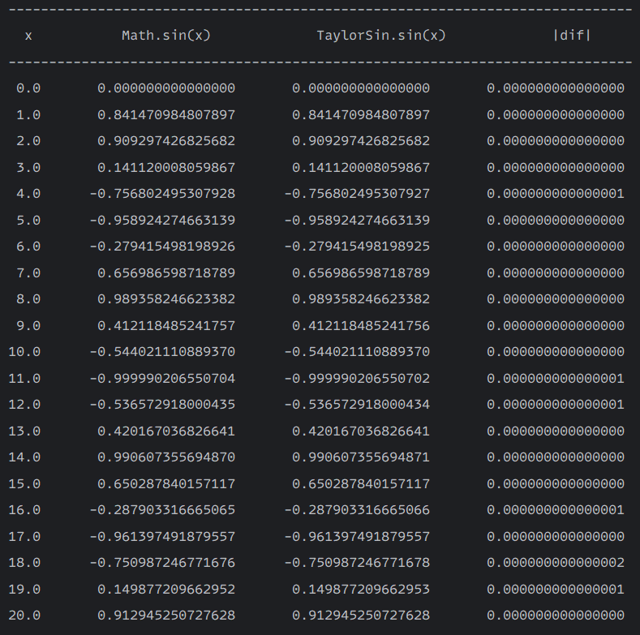
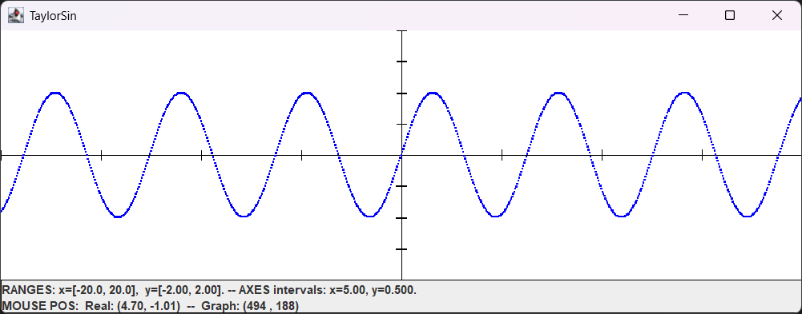

# sin-x-Calc-Implementation

An implementation for calculating the sine of an angle using its Taylor series expansion **with optimizations**. This project provides a Java class, `TaylorSin`, to compute `sin(x)` and a tester class, `TaylorSinTester`, to verify its accuracy against Java's built-in `Math.sin(x)` and visualize the function.

-----

## 📚 Table of Contents

- [How It Works](#-how-it-works)
    - [The Mathematics: Taylor Series for Sine](#-the-mathematics-taylor-series-for-sine)
    - [The Code Implementation](#-the-code-implementation)
- [How to Use](https://www.google.com/search?q=%23-how-to-use)
- [Dependencies](https://www.google.com/search?q=%23-dependencies)

-----

## ⚙️ How It Works

### 📐 The Mathematics: Taylor Series for Sine

The sine of an angle *x* can be expressed as an infinite sum of terms, known as its Taylor series expansion around 0 (or Maclaurin series). This series provides a way to approximate `sin(x)` using polynomials.

The formula is:

$$\sin(x) = x - \frac{x^3}{3!} + \frac{x^5}{5!} - \frac{x^7}{7!} + \dots$$

This can be written in summation notation as:

$$\sin(x) = \sum_{n=0}^{\infty} \frac{(-1)^n x^{2n+1}}{(2n+1)!}$$

This implementation calculates the value by adding terms of this series until the terms become so small that they no longer significantly contribute to the final sum, ensuring a high degree of precision.

### 💻 The Code Implementation

The project calculates `sin(x)` by iteratively summing the terms of the Taylor series.

1.  **Angle Reduction**: Before starting the calculation, the input angle `x` (in radians) is reduced to an equivalent angle within the first circle (from 0 to 2π). This is done using the modulo operator (`x % (2 * Math.PI)`). The Taylor series converges fastest for values of `x` close to 0, and also, working with huge numbers in computational calculations can lead to floating-point precision errors. By reducing the angle to a small range, we keep the intermediate values of the calculation (such as the powers of x) within a manageable range, which helps to preserve the accuracy of the final result, so this step improves the efficiency and precision of the calculation.

2.  **Iterative Summation**: The calculation starts with the first term of the series, `x`. It then enters a loop where it computes and adds the following terms.

3.  **Term Calculation**: We could calculate each term $\frac{(-1)^n x^{2n+1}}{(2n+1)!}$ from scratch in each step of the loop, but that would be highly inefficient (it would involve calculating very large powers and factorials).

    Instead, the algorithm uses a much smarter technique. It observes the relationship between one term ($T_k$) and the next ($T_{k+1}$):
    
    $$T_{k+1} = T_k \cdot \frac{-x^2}{(2k)(2k+1)}$$
    
    The code implements this relationship directly with the line:
    `term *= -x * x / ((2 * k) * (2 * k + 1));`
    
    This completely avoids the calculation of powers and factorials, replacing them with a simple multiplication and division in each step. It is a key optimization that makes the algorithm both viable and fast.

4.  **Precision Control**: The loop continues as long as the absolute value of the current term is greater than a predefined small value, `epsilon`. This `epsilon` represents the maximum acceptable error. Once the terms become smaller than `epsilon`, the series is considered to have converged to a precise enough value, and the loop terminates.

-----

## 🚀 How to Use

You can run the methods in the `TaylorSinTester` class to see the implementation in action.

1.  **Numerical Validation**:
    To see a table comparing the calculated sine values with Java's `Math.sin()`, call:

    ```
    TaylorSinTester.table();
    ```
    The output will look like this:

    

2.  **Graphical Visualization**:
    To display a graph of the implemented sine function, call:

    ```
    TaylorSinTester.graph();
    ```
    The output will look like this:
    
-----

## 🔗 Dependencies

The `TaylorSinTester.graph()` method requires the `graphLib.jar` library for 2D plotting.